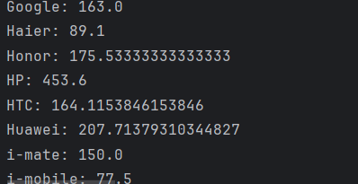
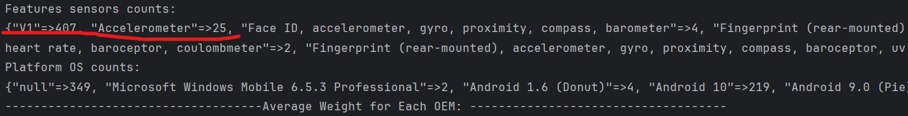
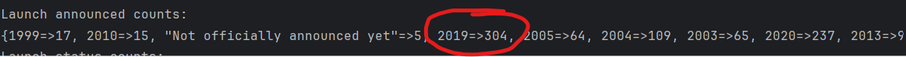

# Alternative-programming-language
**Report**
Please include a README.md file with your repo that will serve as a survey of your explored programming language. Within it discuss several things in a few paragraphs:

* **Which programming language and version did you pick?**

  * I pick **Ruby** as my programming language for this project. The Ruby version is 3.3.1. I'm using RubyMine IDE.

* **Why did you pick this programming language?**
  * I pick Ruby because it's known as one of the easy programming language to learn. Since Spring quarter is very busy so i believe this is the best choice i have.
* **How your programming language chosen handles: object-oriented programming, file ingestion, conditional statements, assignment statements, loops, subprograms (functions/methods), unit testing and exception handling. If one or more of these are not supported by your programming language, indicate it as so.**
  * Ruby is a programming language that brings happiness to many developers' lives. Unlike Java or C++, Ruby stands out for its pure Object-Oriented Programming approach. In Ruby, everything is treated as an object. Each instance is referenced as a pointer or reference. Ruby computation is performed through message passing.
  * The way Ruby handle conditional statements and assignment statements, loops are similar to Java or other OOP programming language.
  * In Ruby, exceptions are treated as objects, providing a powerful error handling system. Exceptions are represented as objects, with a large collection of predefined exception classes. All handled exceptions are either objects of the StandardError class or its subclasses. When an unexpected situation occurs, such as dividing by zero or accessing an invalid index, Ruby throws an exception object. Exception handling in Ruby can be done with the 'rescue' clause, which is attached to a statement within a 'begin-end block' . An 'else' clause and/or an 'ensure' clause can also be included in the block. Ruby also allows for the rerun of code that raised an exception, enhancing flexibility in error recovery. This systematic approach allows developers to create more reliable and flexible software, ensuring smoother execution even in the face of unexpected events.
* **List out 3 libraries you used from your programming language (if applicable) and explain what they are, why you chose them and what you used them for.**
  * Libraries i used in Ruby are:
    * **CSV** which reading and writing CSV files.
    * The second one is **require_relative** which allows user to load files relative to the current file. 
    * The last one is **puts** which similar to print statement and used to output strings to console.
    * **Answer the following questions (and provide a corresponding screen showing output answering them):**
      * What company (oem) has the highest average weight of the phone body?
        * The company has the highest average weight of the phone body is HP with 453.6 grams
    
        * 

      * How many phones have only one feature sensor?
        * There are 432 phones which 407 have V1 sensors and 25 phone come oth Accelerometer sensors.
        * 
      * What year had the most phones launched in any year later than 1999? 
        * 2019 is the year that had the most phones launched later than 1999.
        * 